<h2>TensorFlow-FlexUNet-Image-Segmentation-Satellite-Imagery-Amazon-Forest  (2026/01/01)</h2>
Toshiyuki Arai 
Software Laboratory antillia.com  
This is the first experiment of Image Segmentation for <b></b> based on our <a href="./src/TensorFlowFlexUNet.py">TensorFlowFlexUNet</a> 
(TensorFlow Flexible UNet Image Segmentation Model for Multiclass) , 
and a 512x512 pixels <a href="https://drive.google.com/file/d/1vuZGRdvQGBL8D-55MATqLVJHu17PbFk7/view?usp=sharing">Augmented-Amazon-Forest-ImageMask-Dataset.zip</a> which was derived by us from
  
<a href="https://zenodo.org/records/4498086/files/AMAZON.rar?download=1">AMAZON.rar</a> in 
<a href="https://zenodo.org/records/4498086">Amazon and Atlantic Forest image datasets for semantic segmentation </a> on zenodo.org.
  

<b>Data Augmentation Strategy</b> 
To address the limited size of images and masks of the original <b>Amazon-Forest</b> dataset, which contains 699 GeoTIFF images and TIF masks  respectively,
we generated  the  Augmented dataset by using our <a href="https://github.com/sarah-antillia/Barrel-Image-Distortion-Tool">
Barrel-Image-Distortion-Tool</a>.
   

<b>Actual Image Segmentation for Amazon-Forest Images of 512x512 pixels</b> 
As shown below, the inferred masks predicted by our segmentation model trained by the dataset appear similar to the ground truth masks, but they lack precision in certain areas.
  
<table>
<tr>
<th>Input: image</th>
<th>Mask (ground_truth)</th>
<th>Prediction: inferred_mask</th>
</tr>
<tr>
<td>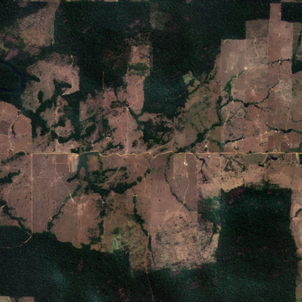</td>
<td>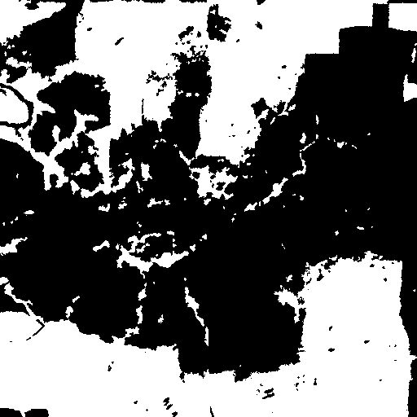</td>
<td>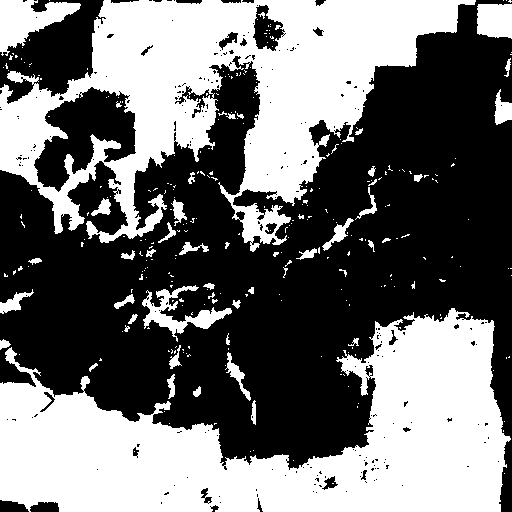</td>
</tr>

<tr>
<td>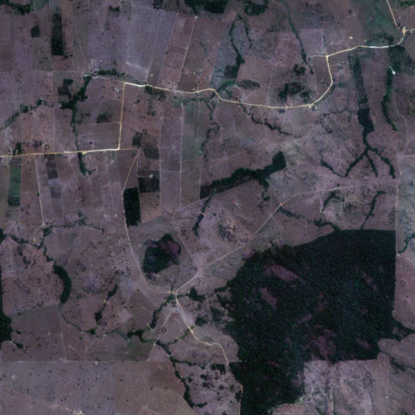</td>
<td></td>
<td>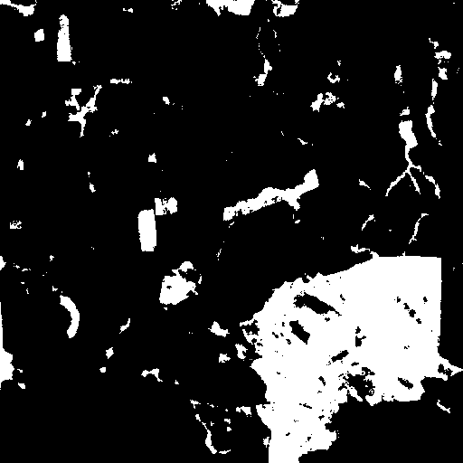</td>
</tr>

<tr>
<td>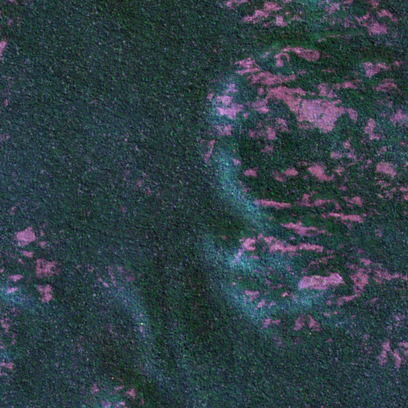</td>
<td>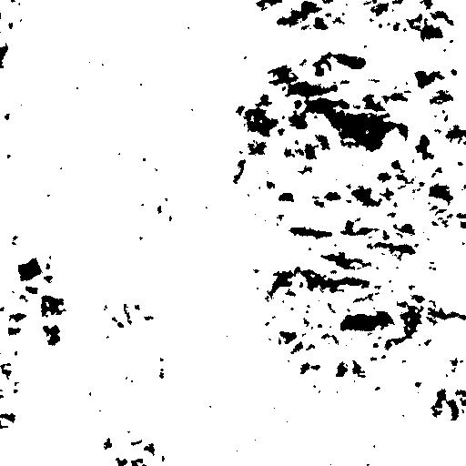</td>
<td></td>
</tr>
</table>

 
<h3>1  Dataset Citation</h3>
The dataset used here was derived from   
<a href="https://zenodo.org/records/4498086/files/AMAZON.rar?download=1">AMAZON.rar</a> in 
<a href="https://zenodo.org/records/4498086">Amazon and Atlantic Forest image datasets for semantic segmentation </a> on zenodo.org.
  
Bragagnolo, Lucimara, da Silva, Roberto Valmir, Grzybowski, José Mario Vicensi 
 
This database contains images from <b>Amazon</b> and <b>Atlantic Forest</b> brazilian
 biomes used for training a fully convolutional neural network for the semantic segmentation of forested areas in images from the 
 <b>Sentinel-2 Level 2A Satellite</b>.
  
 The images refer to the composition of bands 4, 3, 2 and 8. Each band was converted to a byte type (0-255).  
 The images are still divided into three main sets: training, validation and testing: 
<ul>
<li>1. <b>Training dataset:</b> it contains 499 and 485 GeoTIFF images (Amazon and Atlantic Forest, respectively) with 512x512 pixels and associated PNG masks (forest indicated in white and background in black color).
</i>
<li>2. <b>Validation dataset:</b> it contains 100 GeoTIFF images for each biome with 512x512 pixels and associated PNG masks used for validation step.
</li>
<li>3. <b>Test dataset:</b> it contains 20 GeoTIFF images for each biome with 512x512 pixels for testing.
</li>
</ul>

<b>Citation</b> 
Bragagnolo, L., da Silva, R. V., & Grzybowski, J. M. V. (2021).  
Amazon and Atlantic Forest image datasets for semantic segmentation [Data set].  
Zenodo. https://doi.org/10.5281/zenodo.4498086
 
 
<b>License</b> 
<a href="https://creativecommons.org/licenses/by/4.0/legalcode">Creative Commons Attribution 4.0 International</a>
 
 
<h3>
2 Amazon-Forest ImageMask Dataset
</h3>
 If you would like to train this Amazon-Forest Segmentation model by yourself,
please down load our 
<a href="https://drive.google.com/file/d/1vuZGRdvQGBL8D-55MATqLVJHu17PbFk7/view?usp=sharing">Augmented-Amazon-Forest-ImageMask-Dataset.zip</a> on the google drive,
expand the downloaded, and put it under <b>./dataser</b> folder to be. 
<pre>
./dataset
└─Amazon-Forest
    ├─test
    │   ├─images
    │   └─masks
    ├─train
    │   ├─images
    │   └─masks
    └─valid
        ├─images
        └─masks
</pre>
 
<b>Amazon-Forest Statistics</b> 
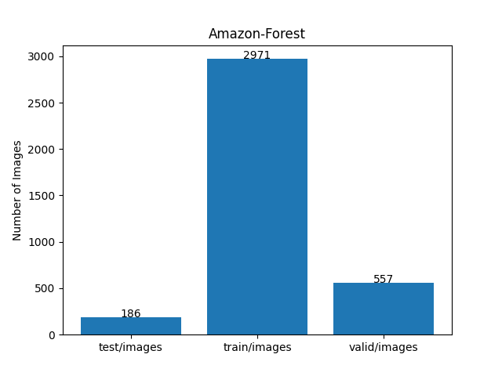 
 
As shown above, the number of images of train and valid datasets is large enough to use for a training set of our segmentation model.
  
<b>Train_images_sample</b> 
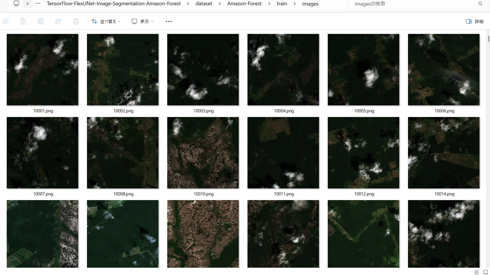
 
<b>Train_masks_sample</b> 
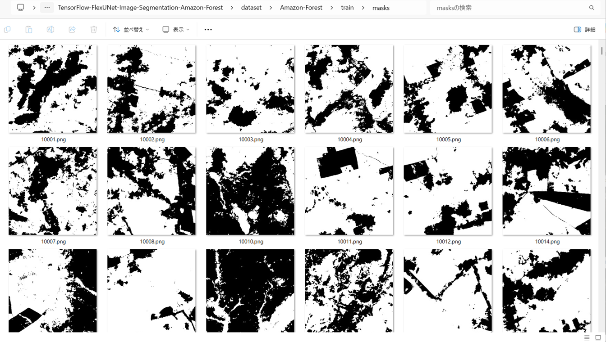
 
<h3>
3 Train TensorflowFlexUNet Model
</h3>
 We trained Amazon-Forest TensorflowFlexUNet Model by using the following
<a href="./projects/TensorFlowFlexUNet/Amazon-Forest/train_eval_infer.config"> <b>train_eval_infer.config</b></a> file.  
Please move to ./projects/TensorFlowFlexUNet/Amazon-Forest and run the following bat file. 
<pre>
>1.train.bat
</pre>
, which simply runs the following command. 
<pre>
>python ../../../src/TensorFlowFlexUNetTrainer.py ./train_eval_infer.config
</pre>

<b>Model parameters</b> 
Defined a small <b>base_filters=16</b> and a large <b>base_kernels=(11,11)</b> for the first Conv Layer of Encoder Block of 
<a href="./src/TensorflowUNet.py">TensorflowUNet.py</a> 
and a large num_layers (including a bridge between Encoder and Decoder Blocks).
<pre>
[model]
image_width    = 512
image_height   = 512
image_channels = 3
input_normalize = True
normalization  = False

num_classes    = 2

base_filters   = 16
base_kernels  = (11,11)
num_layers    = 8

dropout_rate   = 0.05
dilation       = (1,1)
</pre>

<b>Learning rate</b> 
Defined a small learning rate.  
<pre>
[model]
learning_rate  = 0.00007
</pre>

<b>Loss and metrics functions</b> 
Specified "categorical_crossentropy" and "dice_coef_multiclass". 
<pre>
[model]
loss           = "categorical_crossentropy"
metrics        = ["dice_coef_multiclass"]
</pre>
<b >Learning rate reducer callback</b> 
Enabled learing_rate_reducer callback, and a small reducer_patience.
<pre> 
[train]
learning_rate_reducer = True
reducer_factor     = 0.4
reducer_patience   = 4
</pre>
<b>Early stopping callback</b> 
Enabled early stopping callback with patience parameter.
<pre>
[train]
patience      = 10
</pre>
<b></b> 
<b>RGB color map</b> 
rgb color map dict for Amazon-Forest 1+1 classes. 
<pre>
[mask]
mask_file_format = ".png"
;Amazon-Forest 1+1
rgb_map = {(0,0,0):0,  (255, 255, 255):1, }       
</pre>
<b>Epoch change inference callbacks</b> 
Enabled epoch_change_infer callback. 
<pre>
[train]
epoch_change_infer       = True
epoch_change_infer_dir   =  "./epoch_change_infer"
epoch_changeinfer        = False
epoch_changeinfer_dir    = "./epoch_changeinfer"
num_infer_images         = 6
</pre>
By using this epoch_change_infer callback, on every epoch_change, the inference procedure can be called
 for 6 images in <b>mini_test</b> folder. This will help you confirm how the predicted mask changes 
 at each epoch during your training process.    
<b>Epoch_change_inference output at starting (1,2,3)</b> 
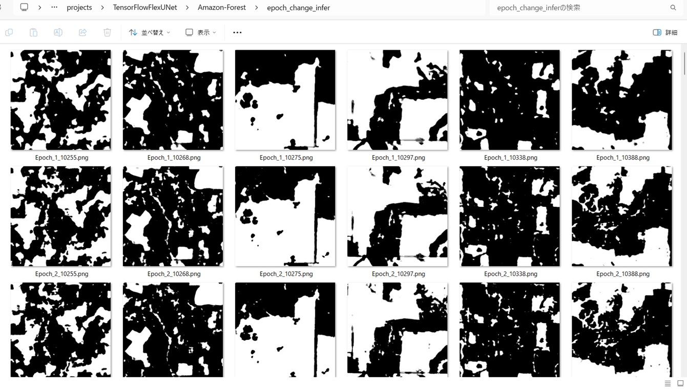 
 
<b>Epoch_change_inference output at ending (38,39,40)</b> 
 
 
<b>Epoch_change_inference output at ending (78,79,80)</b> 
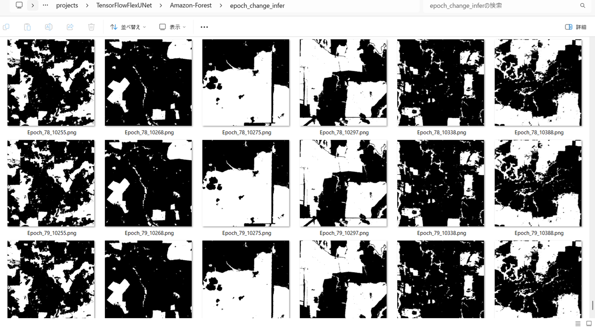 

 
In this experiment, the training process was terminated at epoch 80.  
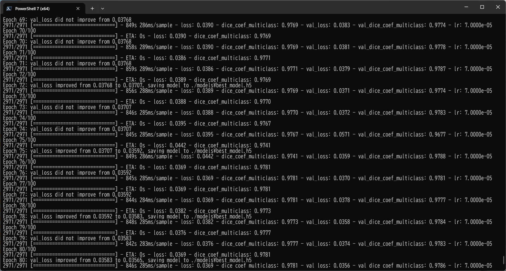 
 
<a href="./projects/TensorFlowFlexUNet/Amazon-Forest/eval/train_metrics.csv">train_metrics.csv</a> 
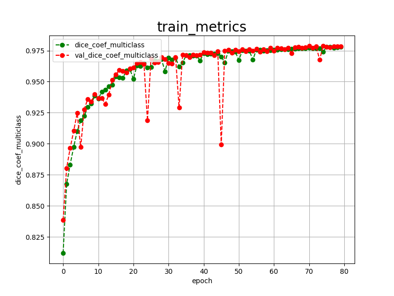 

 
<a href="./projects/TensorFlowFlexUNet/Amazon-Forest/eval/train_losses.csv">train_losses.csv</a> 
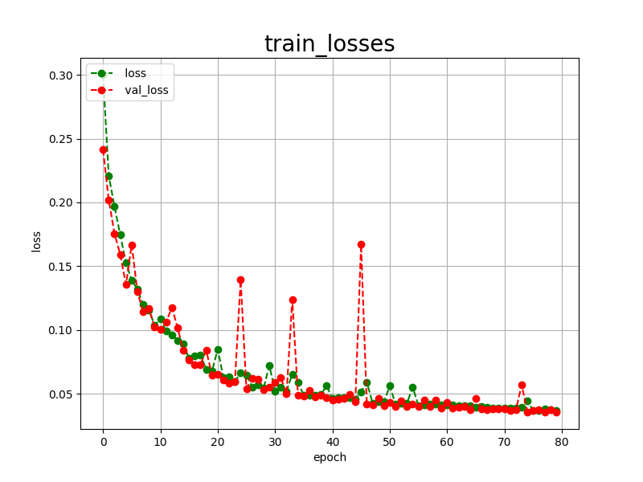 
 
<h3>
4 Evaluation
</h3>
Please move to a <b>./projects/TensorFlowFlexUNet/Amazon-Forest</b> folder, 
and run the following bat file to evaluate TensorflowFlexUNet model for Amazon-Forest. 
<pre>
>./2.evaluate.bat
</pre>
This bat file simply runs the following command.
<pre>
>python ../../../src/TensorFlowFlexUNetEvaluator.py  ./train_eval_infer.config
</pre>
Evaluation console output: 
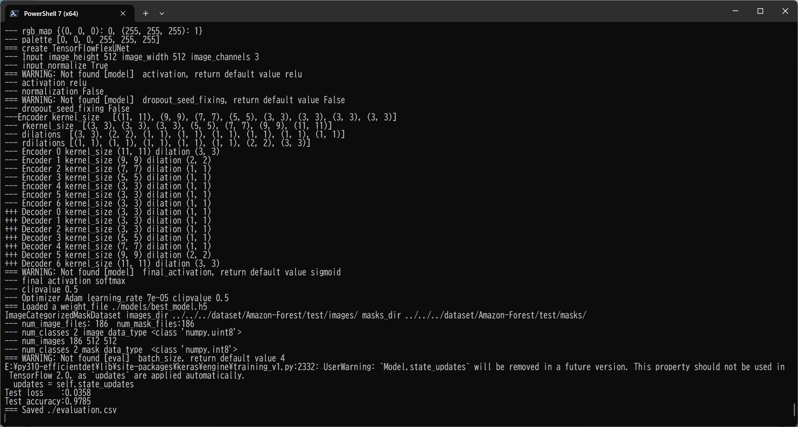
  Image-Segmentation-Amazon-Forest

<a href="./projects/TensorFlowFlexUNet/Amazon-Forest/evaluation.csv">evaluation.csv</a> 
The loss (categorical_crossentropy) to this Amazon-Forest/test was not low, but dice_coef_multiclass  high as shown below.
 
<pre>
categorical_crossentropy,0.0358
dice_coef_multiclass,0.9785
</pre>
 
<h3>5 Inference</h3>
Please move to a <b>./projects/TensorFlowFlexUNet/Amazon-Forest</b> folder 
,and run the following bat file to infer segmentation regions for images by the Trained-TensorflowFlexUNet model for Amazon-Forest. 
<pre>
>./3.infer.bat
</pre>
This simply runs the following command.
<pre>
>python ../../../src/TensorFlowFlexUNetInferencer.py ./train_eval_infer.config
</pre>

<b>mini_test_images</b> 
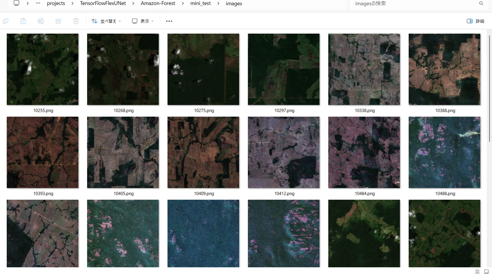 
<b>mini_test_mask(ground_truth)</b> 
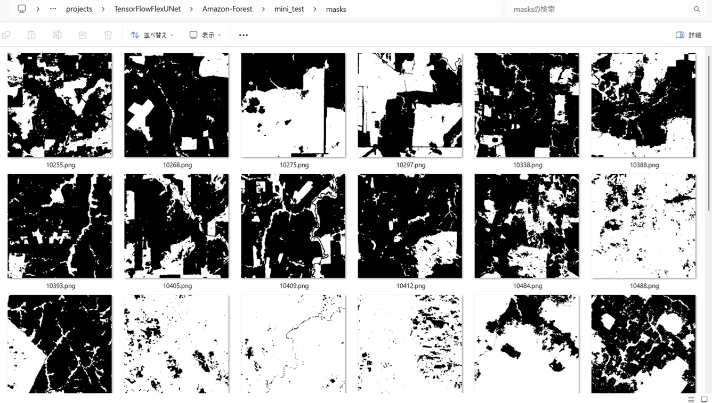 

<b>Inferred test masks</b> 
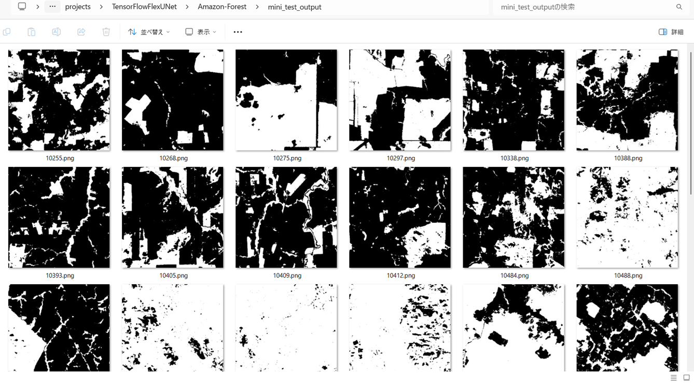 
 

<b>Enlarged images and masks for Amazon-Forest Images of 512x512 pixels</b> 
As shown below, the inferred masks predicted by our segmentation model trained by the dataset appear similar to the ground truth masks, but they lack precision in certain areas.
 
 
<table>
<tr>
<th>Input: image</th>
<th>Mask (ground_truth)</th>
<th>Prediction: inferred_mask</th>
</tr>
<tr>
<td>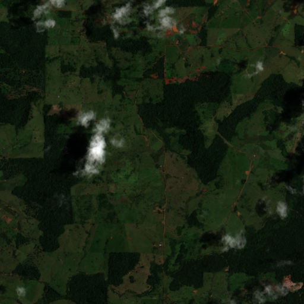</td>
<td></td>
<td>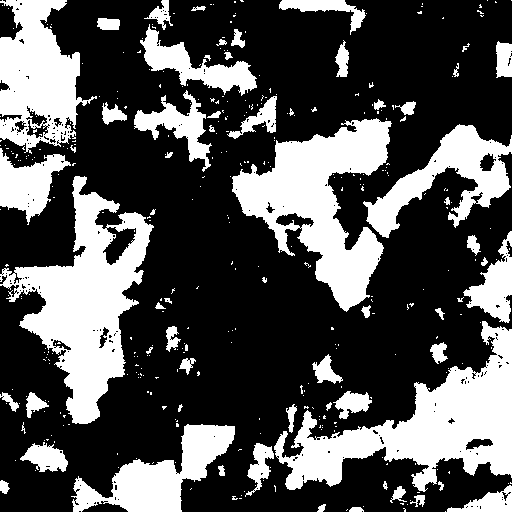</td>
</tr>

<tr>
<td>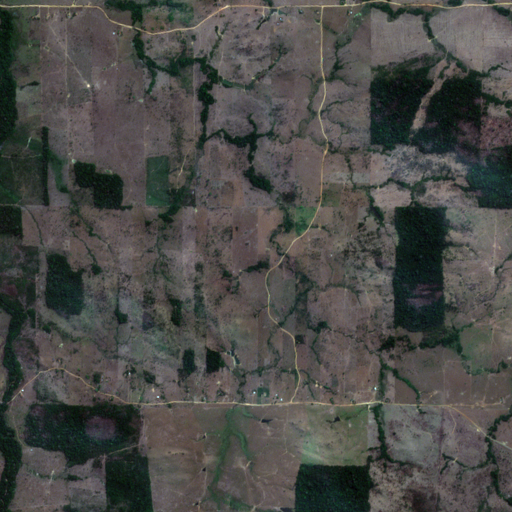</td>
<td></td>
<td>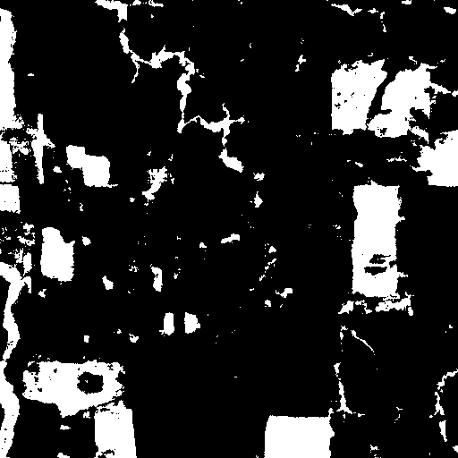</td>
</tr>

<tr>
<td>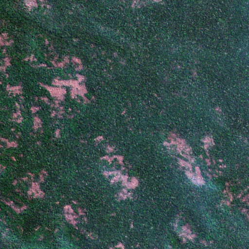</td>
<td></td>
<td>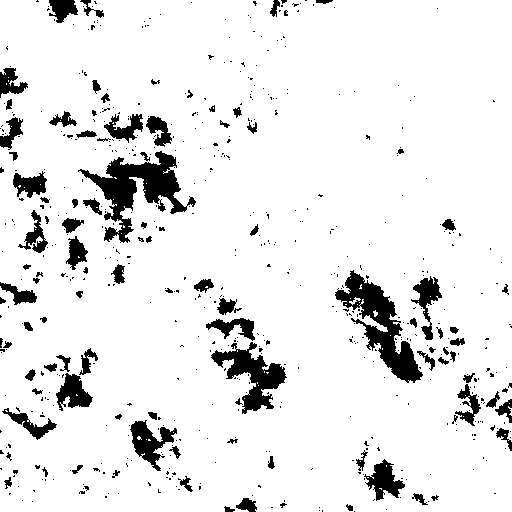</td>
</tr>
<tr>
<td>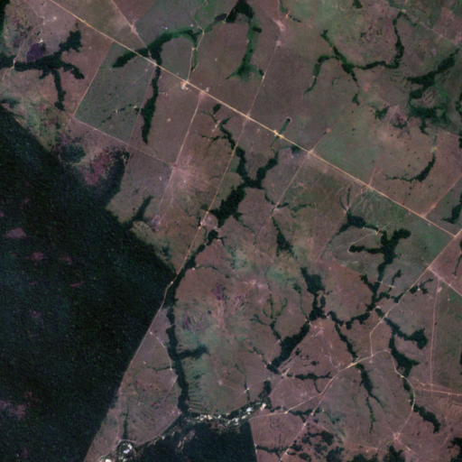</td>
<td>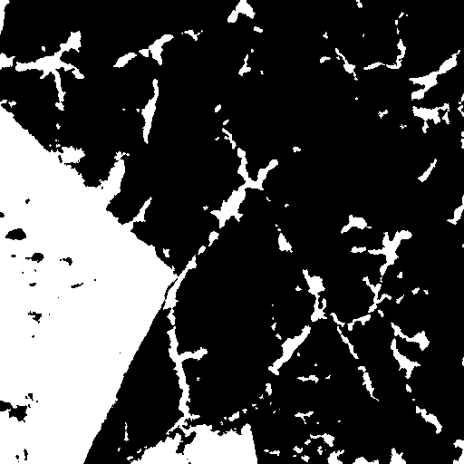</td>
<td></td>
</tr>
<tr>
<td>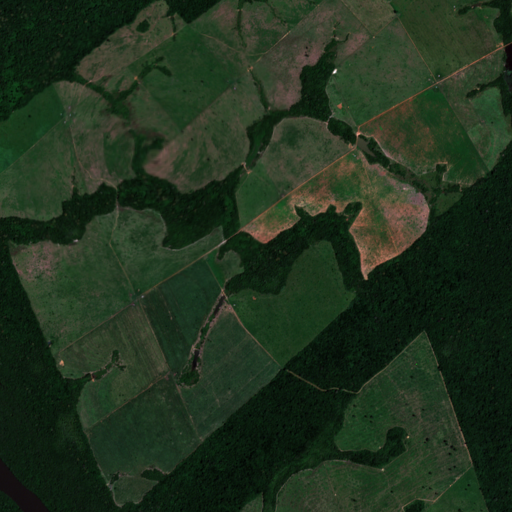</td>
<td></td>
<td>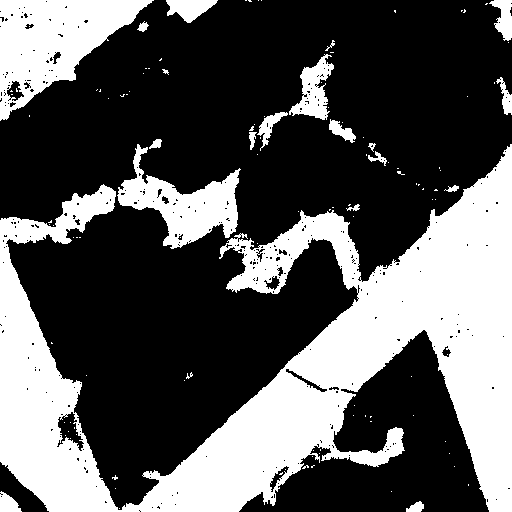</td>
</tr>
<tr>
<td>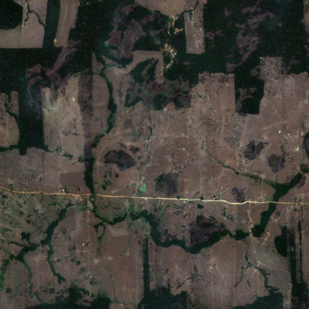</td>
<td></td>
<td>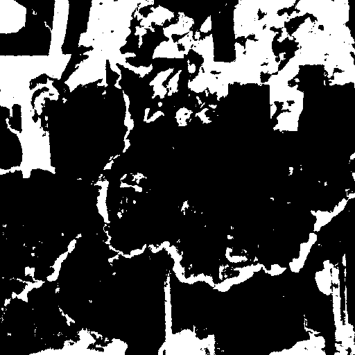</td>
</tr>
</table>

 
<h3>
References
</h3>

<b>1.  An attention-based U-Net for detecting deforestation within satellite 
sensor imagery</b> 
David John, Ce Zhang 
<a href="https://www.sciencedirect.com/science/article/pii/S0303243422000113">https://www.sciencedirect.com/science/article/pii/S0303243422000113</a>
 
 
<b>2.  FOREST SEMANTIC SEGMENTATION BASED ON DEEP LEARNING USING 
SENTINEL-2 IMAGES </b> 
C. Hızal,  G. Gülsu, H. Y. Akgün,  B. Kulavuz, T. Bakırman, A. Aydın, B. Bayram 
<a href="https://isprs-archives.copernicus.org/articles/XLVIII-4-W9-2024/229/2024/isprs-archives-XLVIII-4-W9-2024-229-2024.pdf">
https://isprs-archives.copernicus.org/articles/XLVIII-4-W9-2024/229/2024/isprs-archives-XLVIII-4-W9-2024-229-2024.pdf</a> 
  

<b>3. TensorFlow-FlexUNet-Image-Segmentation-Model</b> 
Toshiyuki Arai  
<a href="https://github.com/sarah-antillia/TensorFlow-FlexUNet-Image-Segmentation-Model">
TensorFlow-FlexUNet-Image-Segmentation-Model
</a>
 
 
